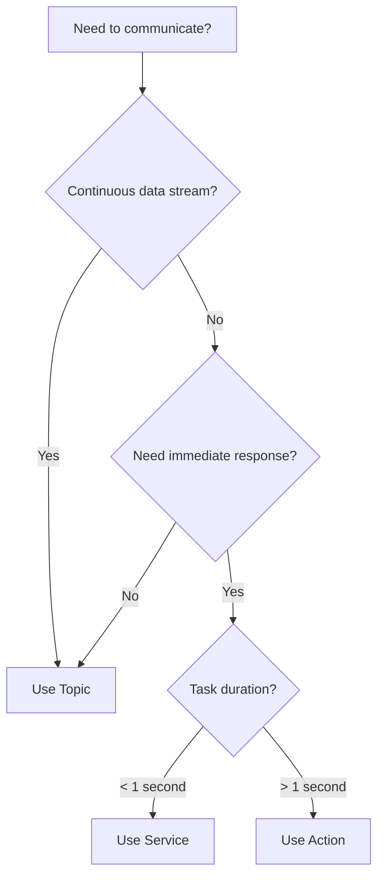

# 1.2 Building Basic Robot Communication

Now that we understand the conceptual foundations of ROS 2, let's get hands-on! In this section, we'll implement the three core communication primitives:

1. **Topics** (Publisher/Subscriber) - for continuous data streams
2. **Services** (Client/Server) - for request-response patterns
3. **(Preview) Actions** - for long-running tasks with feedback

By the end of this section, you'll be able to write ROS 2 nodes that send, receive, and request information.

## Prerequisites

Before you begin, ensure you have:
- **ROS 2 Humble or Iron** installed on Ubuntu 22.04 LTS
- Python 3.10+ with `rclpy` (ROS 2 Python client library)
- Basic understanding of Python classes and object-oriented programming

:::tip Quick ROS 2 Setup Check
Verify your installation:
```bash
ros2 --version
python3 --version
```
Expected output: `ros2 cli version 0.X.X` and `Python 3.10.X` or higher.
:::

## Project Structure

Our code examples are organized as follows:

```text
src/ros2_chapter1/
├── nodes/
│   ├── simple_publisher.py       # Topic publisher example
│   ├── simple_subscriber.py      # Topic subscriber example
│   └── service_client_server.py  # Service client/server example
├── urdf/
└── launch/
```

All Python nodes follow ROS 2 conventions:
- Each node is a class inheriting from `rclpy.node.Node`
- Nodes are executable with `#!/usr/bin/env python3` shebang
- Nodes use ROS 2 logging (`self.get_logger()`) instead of `print()`

## 1. Topics: Publishing Messages

Let's start with **publishing** messages to a topic. This is how sensor nodes broadcast data (like camera images or lidar scans) to other parts of the system.

### Code Example: Simple Publisher

import Tabs from '@theme/Tabs';
import TabItem from '@theme/TabItem';

<Tabs>
<TabItem value="code" label="Python Code" default>

```python title="src/ros2_chapter1/nodes/simple_publisher.py"
#!/usr/bin/env python3
import rclpy
from rclpy.node import Node
from std_msgs.msg import String


class SimplePublisher(Node):
    def __init__(self):
        super().__init__('simple_publisher')

        # Create a publisher that publishes String messages to '/robot/message'
        self.publisher_ = self.create_publisher(
            String,              # Message type
            '/robot/message',    # Topic name
            10                   # Queue size (buffer for slow subscribers)
        )

        # Create a timer that calls timer_callback() every 1.0 second
        timer_period = 1.0
        self.timer = self.create_timer(timer_period, self.timer_callback)
        self.count = 0

        self.get_logger().info('Simple Publisher started. Publishing to /robot/message')

    def timer_callback(self):
        msg = String()
        msg.data = f'Hello from ROS 2! Message count: {self.count}'
        self.publisher_.publish(msg)
        self.get_logger().info(f'Publishing: "{msg.data}"')
        self.count += 1


def main(args=None):
    rclpy.init(args=args)
    node = SimplePublisher()
    try:
        rclpy.spin(node)
    except KeyboardInterrupt:
        pass
    finally:
        node.destroy_node()
        rclpy.shutdown()


if __name__ == '__main__':
    main()
```

</TabItem>
<TabItem value="explanation" label="Explanation">

**Key Concepts:**

1. **`create_publisher()`**: Creates a publisher object
   - `String`: Message type (from `std_msgs.msg`)
   - `'/robot/message'`: Topic name (must start with `/`)
   - `10`: Queue size (buffers messages if subscribers are slow)

2. **`create_timer()`**: Triggers a callback at fixed intervals
   - `timer_period`: Time in seconds between callbacks
   - `self.timer_callback`: Function to call

3. **`publisher_.publish(msg)`**: Sends the message to all subscribers

4. **`rclpy.spin(node)`**: Keeps the node alive and processes callbacks

**Quality of Service (QoS):**
By default, publishers use "reliable" delivery with a history depth of 10. For real-time sensor data, you can use "best-effort" QoS to prioritize low latency over reliability.

</TabItem>
</Tabs>

### Running the Publisher

Make the script executable and run it:

```bash
# Make executable (first time only)
chmod +x src/ros2_chapter1/nodes/simple_publisher.py

# Run the publisher
python3 src/ros2_chapter1/nodes/simple_publisher.py
```

Expected output:
```text
[INFO] [1234567890.123456789] [simple_publisher]: Simple Publisher started. Publishing to /robot/message
[INFO] [1234567890.123456789] [simple_publisher]: Publishing: "Hello from ROS 2! Message count: 0"
[INFO] [1234567891.123456789] [simple_publisher]: Publishing: "Hello from ROS 2! Message count: 1"
...
```

### Inspecting the Topic

While the publisher is running, open a new terminal and inspect the topic:

```bash
# List all active topics
ros2 topic list

# Show information about the topic
ros2 topic info /robot/message

# Echo (display) messages in real-time
ros2 topic echo /robot/message
```

Expected output from `ros2 topic echo`:
```yaml
data: 'Hello from ROS 2! Message count: 0'
---
data: 'Hello from ROS 2! Message count: 1'
---
```

## 2. Topics: Subscribing to Messages

Now let's create a **subscriber** that listens to the messages published by our publisher node.

### Code Example: Simple Subscriber

<Tabs>
<TabItem value="code" label="Python Code" default>

```python title="src/ros2_chapter1/nodes/simple_subscriber.py"
#!/usr/bin/env python3
import rclpy
from rclpy.node import Node
from std_msgs.msg import String


class SimpleSubscriber(Node):
    def __init__(self):
        super().__init__('simple_subscriber')

        # Create a subscription to the '/robot/message' topic
        self.subscription = self.create_subscription(
            String,                  # Message type
            '/robot/message',        # Topic name
            self.listener_callback,  # Callback function
            10                       # Queue size
        )
        self.subscription  # Prevent unused variable warning
        self.count = 0

        self.get_logger().info('Simple Subscriber started. Listening to /robot/message')

    def listener_callback(self, msg):
        """Called when a message is received."""
        self.count += 1
        self.get_logger().info(f'Received message #{self.count}: "{msg.data}"')


def main(args=None):
    rclpy.init(args=args)
    node = SimpleSubscriber()
    try:
        rclpy.spin(node)
    except KeyboardInterrupt:
        pass
    finally:
        node.destroy_node()
        rclpy.shutdown()


if __name__ == '__main__':
    main()
```

</TabItem>
<TabItem value="explanation" label="Explanation">

**Key Concepts:**

1. **`create_subscription()`**: Creates a subscriber object
   - Listens to the specified topic
   - Calls `listener_callback()` whenever a message arrives

2. **Callback Function**: `listener_callback(self, msg)`
   - Automatically called by ROS 2 when a message is received
   - `msg` parameter contains the received message data

3. **Asynchronous Processing**: The callback is triggered by ROS 2's event loop (`rclpy.spin()`), not by your code directly.

**Performance Note:**
Callbacks should execute quickly (< 10ms). For computationally expensive tasks, use a separate thread or process the data in a separate node.

</TabItem>
</Tabs>

### Running Publisher and Subscriber Together

Open two terminals:

**Terminal 1 (Publisher):**
```bash
python3 src/ros2_chapter1/nodes/simple_publisher.py
```

**Terminal 2 (Subscriber):**
```bash
python3 src/ros2_chapter1/nodes/simple_subscriber.py
```

You should see:
- **Terminal 1**: "Publishing: ..."
- **Terminal 2**: "Received message #X: ..."

Congratulations! You've just established your first ROS 2 communication link! 🎉

## 3. Services: Request-Response Communication

Topics are great for continuous data, but what if you need a **question-and-answer** interaction? That's where **services** come in.

### Use Case: Adding Two Integers

We'll implement a service that adds two integers together:
- **Server**: Receives two integers, adds them, returns the sum
- **Client**: Sends a request with two integers, receives the sum

### Code Example: Service Server and Client

<Tabs>
<TabItem value="code" label="Python Code" default>

```python title="src/ros2_chapter1/nodes/service_client_server.py"
#!/usr/bin/env python3
import rclpy
from rclpy.node import Node
from example_interfaces.srv import AddTwoInts


class AddTwoIntsServer(Node):
    def __init__(self):
        super().__init__('add_two_ints_server')

        # Create a service server that handles AddTwoInts requests
        self.srv = self.create_service(
            AddTwoInts,                  # Service type
            '/add_two_ints',             # Service name
            self.add_two_ints_callback   # Callback function
        )
        self.get_logger().info('AddTwoInts service server started at /add_two_ints')

    def add_two_ints_callback(self, request, response):
        """Handle addition requests."""
        response.sum = request.a + request.b
        self.get_logger().info(
            f'Request: a={request.a}, b={request.b} -> sum={response.sum}'
        )
        return response


class AddTwoIntsClient(Node):
    def __init__(self, a, b):
        super().__init__('add_two_ints_client')

        # Create a service client for AddTwoInts
        self.cli = self.create_client(AddTwoInts, '/add_two_ints')

        # Wait for the service to become available
        while not self.cli.wait_for_service(timeout_sec=1.0):
            self.get_logger().info('Waiting for service /add_two_ints...')

        # Create a request
        self.req = AddTwoInts.Request()
        self.req.a = a
        self.req.b = b
        self.get_logger().info(f'Service client ready. Request: a={a}, b={b}')

    def send_request(self):
        """Send the request to the server."""
        self.get_logger().info(f'Calling service with a={self.req.a}, b={self.req.b}')
        self.future = self.cli.call_async(self.req)
        return self.future


def main(args=None):
    rclpy.init(args=args)

    # Read parameters to determine mode
    temp_node = rclpy.create_node('param_reader')
    temp_node.declare_parameter('mode', 'server')
    temp_node.declare_parameter('a', 0)
    temp_node.declare_parameter('b', 0)

    mode = temp_node.get_parameter('mode').value
    a = temp_node.get_parameter('a').value
    b = temp_node.get_parameter('b').value
    temp_node.destroy_node()

    if mode == 'server':
        node = AddTwoIntsServer()
        try:
            rclpy.spin(node)
        except KeyboardInterrupt:
            pass
        finally:
            node.destroy_node()

    elif mode == 'client':
        node = AddTwoIntsClient(a, b)
        future = node.send_request()
        rclpy.spin_until_future_complete(node, future)

        if future.result() is not None:
            response = future.result()
            node.get_logger().info(f'Response: {a} + {b} = {response.sum}')
        else:
            node.get_logger().error('Service call failed')

        node.destroy_node()

    rclpy.shutdown()


if __name__ == '__main__':
    main()
```

</TabItem>
<TabItem value="explanation" label="Explanation">

**Server Side:**

1. **`create_service()`**: Registers a service
   - `AddTwoInts`: Service type (request has `a`, `b`; response has `sum`)
   - `'/add_two_ints'`: Service name
   - Callback receives `request` and `response` objects

2. **Callback Function**: Processes the request and populates the response

**Client Side:**

1. **`create_client()`**: Creates a client to call the service

2. **`wait_for_service()`**: Blocks until the server is available

3. **`call_async()`**: Sends the request asynchronously
   - Returns a `Future` object
   - Use `spin_until_future_complete()` to wait for the response

**Why Async?**
Asynchronous service calls prevent the client from freezing while waiting for a response. For long-running tasks, use **Actions** instead.

</TabItem>
</Tabs>

### Running the Service

**Terminal 1 (Server):**
```bash
python3 src/ros2_chapter1/nodes/service_client_server.py --ros-args -p mode:=server
```

**Terminal 2 (Client):**
```bash
python3 src/ros2_chapter1/nodes/service_client_server.py --ros-args -p mode:=client -p a:=10 -p b:=25
```

Expected output:
- **Terminal 1**: `Request: a=10, b=25 -> sum=35`
- **Terminal 2**: `Response: 10 + 25 = 35`

You can also call the service manually:
```bash
ros2 service call /add_two_ints example_interfaces/srv/AddTwoInts "{a: 42, b: 58}"
```

## Choosing the Right Communication Primitive

Here's a practical decision tree:



### Real-World Examples

| Scenario | Primitive | Why? |
|----------|-----------|------|
| Camera publishes images at 30 Hz | **Topic** | Continuous, high-frequency, multiple subscribers |
| Request current robot pose | **Service** | One-time query, fast response |
| Navigate to goal (10+ seconds) | **Action** | Long-running, needs progress feedback, cancelable |
| IMU publishes orientation at 100 Hz | **Topic** | High-frequency sensor data |
| Set camera exposure | **Service** | Configuration change with confirmation |

## Hands-On Exercise

Try modifying the examples:

1. **Publisher Challenge**: Modify `simple_publisher.py` to publish the current timestamp instead of a message count.

2. **Subscriber Challenge**: Create a subscriber that:
   - Subscribes to `/robot/message`
   - Counts the total number of words received
   - Publishes the word count to a new topic `/robot/word_count`

3. **Service Challenge**: Implement a new service that:
   - Takes a string as input
   - Returns the string reversed
   - Hint: Use `std_srvs/srv/Trigger` or define a custom service type

<details>
<summary>Solution Hint for Challenge 2</summary>

```python
class WordCounterNode(Node):
    def __init__(self):
        super().__init__('word_counter')
        self.subscription = self.create_subscription(
            String, '/robot/message', self.callback, 10
        )
        self.publisher = self.create_publisher(Int32, '/robot/word_count', 10)
        self.total_words = 0

    def callback(self, msg):
        words = len(msg.data.split())
        self.total_words += words

        count_msg = Int32()
        count_msg.data = self.total_words
        self.publisher.publish(count_msg)
```

</details>

## Summary

In this section, you learned to:
- ✅ Create a ROS 2 publisher to broadcast messages on a topic
- ✅ Create a ROS 2 subscriber to receive messages from a topic
- ✅ Implement a service server to handle synchronous requests
- ✅ Implement a service client to send requests and receive responses
- ✅ Choose the appropriate communication primitive for different scenarios

**Key Takeaways:**
- **Topics** = Asynchronous, many-to-many, continuous data
- **Services** = Synchronous, one-to-one, request-response
- **Actions** = Asynchronous, long-running tasks with feedback (covered in advanced chapters)

Next, we'll explore how to integrate high-level AI decision-making systems (like LLMs) with ROS 2 controllers.

## Further Reading

- [ROS 2 rclpy API Documentation](https://docs.ros2.org/latest/api/rclpy/index.html)
- [ROS 2 Tutorials: Writing a Simple Publisher and Subscriber](https://docs.ros.org/en/humble/Tutorials/Beginner-Client-Libraries/Writing-A-Simple-Py-Publisher-And-Subscriber.html)
- [ROS 2 Tutorials: Writing a Simple Service and Client](https://docs.ros.org/en/humble/Tutorials/Beginner-Client-Libraries/Writing-A-Simple-Py-Service-And-Client.html)
- [ROS 2 QoS Policies](https://docs.ros.org/en/humble/Concepts/About-Quality-of-Service-Settings.html)
