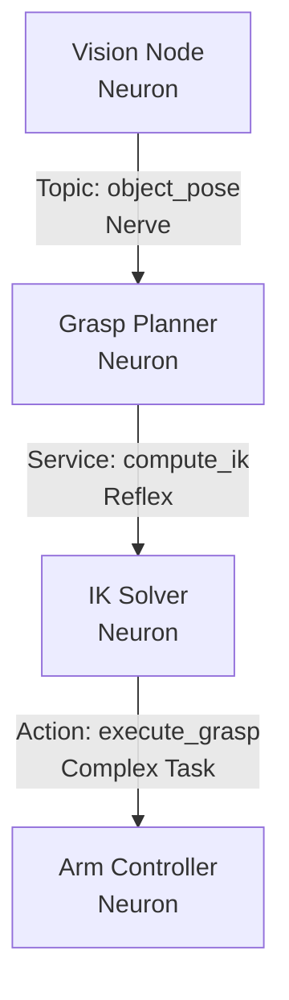

# 1.1 Understanding a Robot's Nervous System

## Why Do Robots Need a Communication System?

Imagine building a humanoid robot that can walk, grasp objects, perceive its environment, and interact with humans. This robot isn't a single monolithic program—it's a complex orchestra of specialized components working in harmony:

- **Vision systems** processing camera feeds to detect objects
- **Motion planners** calculating trajectories for arms and legs
- **Balance controllers** maintaining stability during movement
- **Speech recognition** understanding voice commands
- **Decision-making AI** coordinating high-level behaviors

Each of these systems is like an organ in a biological body, specialized for a specific function. But how do they coordinate? How does the vision system tell the grasping controller where an object is located? How does the AI decision-maker command the legs to walk forward?

This is where **robot middleware**—specifically ROS 2 (Robot Operating System 2)—comes in. It acts as the **nervous system** of the robot, enabling different software components to communicate, coordinate, and share information in real-time.

## The Biological Analogy

In a biological nervous system:
- **Neurons** (nerve cells) process information
- **Nerves** (bundles of axons) transmit signals between neurons
- **Reflexes** enable rapid, automated responses to stimuli
- **The brain** coordinates complex, long-term behaviors

In a robot's ROS 2 nervous system:
- **Nodes** are like neurons—independent processes performing specific computations
- **Topics** are like nerves—communication channels where nodes publish and subscribe to messages
- **Services** are like reflexes—request-response patterns for immediate actions
- **Actions** coordinate complex, long-running tasks with feedback (like the brain directing a sequence of movements)



## Why Not Just Normal Programming Scripts?

You might wonder: "Why can't I just write Python functions that call each other?" There are several critical reasons:

### 1. Distributed Computing

In modern robotics, different components often run on different processors. Your vision system might run on a GPU, your motion planner on a CPU, and your low-level motor controllers on an embedded microcontroller. ROS 2 enables seamless communication across these distributed systems.

**Example Scenario:**
```text
┌─────────────────┐       ┌─────────────────┐       ┌──────────────────┐
│ GPU (RTX 4070)  │       │ CPU (x86)       │       │ MCU (STM32)      │
│                 │       │                 │       │                  │
│ Vision Node     │──────>│ Motion Planner  │──────>│ Motor Controller │
│ (YOLOv8)        │ Topic │ (Nav2)          │ Topic │ (PWM Signals)    │
└─────────────────┘       └─────────────────┘       └──────────────────┘
```

### 2. Modularity and Reusability

With ROS 2, you can swap out components without rewriting your entire system. Want to upgrade your camera? Just replace the vision node—everything else keeps working. This modularity accelerates development and enables code reuse across projects.

**Reality Check:**
> In industrial robotics, companies often use the same navigation stack across multiple robot platforms. With ROS 2, you write the navigation logic once and reuse it on wheeled robots, humanoids, and drones—only swapping out the hardware interface layer.

### 3. Concurrency and Real-Time Performance

Robots need to do many things simultaneously—perceiving, planning, and acting in parallel. ROS 2's node-based architecture naturally supports concurrent execution, and its DDS (Data Distribution Service) middleware provides real-time communication guarantees.

**Performance Metrics:**
- **Topic latency**: < 1ms on local machine, < 10ms over network
- **Service call overhead**: ~100μs for local calls
- **Action feedback rate**: Up to 1000 Hz for control loops

### 4. Language Agnostic

Your AI might be written in Python, your motion planner in C++, and your embedded controllers in C. ROS 2 allows these different languages to communicate seamlessly through standardized message formats.

```python
# Python node (AI decision-maker)
self.publisher_ = self.create_publisher(Twist, '/cmd_vel', 10)
```

```cpp
// C++ node (motor controller)
subscription_ = this->create_subscription<Twist>(
  "/cmd_vel", 10, std::bind(&MotorController::callback, this, _1));
```

### 5. Debugging and Introspection

ROS 2 provides powerful tools to visualize data flows, record and replay sensor data, and debug complex robot behaviors—capabilities that are extremely difficult to achieve with traditional programming.

**Key Tools:**
- `ros2 topic list`: See all active communication channels
- `ros2 topic echo /camera/image`: Monitor real-time data
- `ros2 bag record`: Record sensor data for offline analysis
- `rviz2`: Visualize robot state and sensor data in 3D

### 6. Community and Ecosystem

ROS 2 has a massive ecosystem of pre-built packages for navigation, manipulation, perception, and more. You don't need to reinvent the wheel—you can leverage decades of robotics research.

**Popular ROS 2 Packages:**
- **Nav2**: Autonomous navigation and path planning
- **MoveIt 2**: Motion planning for robotic arms
- **SLAM Toolbox**: Simultaneous localization and mapping
- **Isaac ROS**: NVIDIA-accelerated perception and navigation

## Core ROS 2 Components

Now that we understand *why* we need ROS 2, let's define its core building blocks:

### 1. Nodes (The Neurons)

A **node** is an independent process that performs a specific computation.

**Examples:**
- A `camera_driver` node that publishes image data
- An `object_detector` node that processes images to identify objects
- A `motor_controller` node that sends commands to actuators

**Key Properties:**
- Nodes run independently and can be distributed across multiple machines
- Each node has a unique name (e.g., `/vision/camera_left`, `/planner/motion`)
- Nodes can be written in Python, C++, or other supported languages
- Nodes can be started, stopped, and restarted without affecting other nodes (in most cases)

**Node Lifecycle States:**
```text
Unconfigured → Inactive → Active → Inactive → Finalized
```

:::tip Best Practice
Use **lifecycle nodes** for production systems. They provide explicit state management (configuring, activating, deactivating) which is essential for safe startup/shutdown and hot-swapping components.
:::

### 2. Topics (The Nerves)

A **topic** is a named communication channel where nodes publish and subscribe to messages asynchronously.

**Publisher-Subscriber Pattern:**
- **Publishers** send (publish) messages to a topic
- **Subscribers** receive (subscribe to) messages from a topic
- Multiple publishers and subscribers can connect to the same topic
- Communication is **asynchronous**—publishers don't wait for subscribers

**Example:**
```text
Topic: /robot/joint_states
Publisher: joint_state_publisher (broadcasts current joint angles)
Subscribers: robot_state_monitor, rviz_visualizer, motion_planner
```

**Message Flow Diagram:**
```text
┌────────────────────┐
│  Camera Driver     │
│  (Publisher)       │
└─────────┬──────────┘
          │ /camera/image (sensor_msgs/Image)
          ├──────────────────┐
          │                  │
          ▼                  ▼
┌─────────────────┐   ┌──────────────────┐
│  Object         │   │  Image Display   │
│  Detector       │   │  (RViz)          │
│  (Subscriber)   │   │  (Subscriber)    │
└─────────────────┘   └──────────────────┘
```

**Use Cases:**
- Sensor data streaming (camera images, lidar scans, IMU data)
- Status updates (battery level, robot pose)
- Continuous control signals (velocity commands)

### 3. Services (The Reflexes)

A **service** provides a request-response communication pattern for synchronous interactions.

**Client-Server Pattern:**
- A **service server** waits for requests and sends back responses
- A **service client** sends a request and waits (blocks) for a response
- Communication is **synchronous**—the client waits until the server replies

**Example:**
```text
Service: /robot/set_mode
Server: mode_controller (receives mode requests, switches robot mode, returns success/failure)
Client: user_interface (sends mode change request, waits for confirmation)
```

**Request-Response Flow:**
```text
┌──────────────────┐                        ┌──────────────────┐
│  Client Node     │                        │  Server Node     │
│  (UI)            │                        │  (Mode Manager)  │
└────────┬─────────┘                        └────────┬─────────┘
         │                                           │
         │ Request: set_mode(mode="WALK")           │
         ├──────────────────────────────────────────>│
         │                                           │
         │                                           │ [Processing...]
         │                                           │
         │ Response: success=True, message="OK"     │
         │<──────────────────────────────────────────┤
         │                                           │
```

**Use Cases:**
- Configuration changes (set camera resolution, change control mode)
- On-demand computations (inverse kinematics calculation)
- State queries (get current robot pose, check system health)

:::warning Blocking Behavior
Services block the client until the server responds. For long-running tasks (> 1 second), use **Actions** instead to avoid freezing your application.
:::

### 4. Actions (Long-Running Tasks)

An **action** is a communication pattern for long-running, goal-oriented tasks with continuous feedback.

**Action Pattern:**
- A **goal** is sent to the action server (e.g., "navigate to coordinates (5, 10)")
- The server provides **feedback** during execution (e.g., "25% complete", "approaching goal")
- The client can **cancel** the goal mid-execution
- A **result** is returned when the goal completes or fails

**Example:**
```text
Action: /navigation/navigate_to_pose
Server: navigation_controller
Client: mission_planner
Goal: Target pose (x=5.0, y=10.0, theta=0.0)
Feedback: Current distance to goal=3.2m, estimated time remaining=15s
Result: Success, final pose error < 0.1m
```

**Action Timeline:**
```text
Client                                    Server
  │                                         │
  ├─────Goal: navigate_to(5, 10)──────────>│
  │                                         │ [Planning path...]
  │<────Feedback: distance_remaining=7.5m──┤
  │                                         │ [Moving...]
  │<────Feedback: distance_remaining=4.2m──┤
  │                                         │ [Moving...]
  │<────Feedback: distance_remaining=1.0m──┤
  │                                         │ [Arrived!]
  │<────Result: success=True, error=0.05m──┤
  │                                         │
```

**Use Cases:**
- Navigation ("move to this location")
- Manipulation ("pick up this object")
- Multi-step behaviors ("perform a dance routine")

## Comparing Communication Primitives

| Primitive | Direction | Synchronous? | Feedback? | Cancelable? | Use Case |
|-----------|-----------|--------------|-----------|-------------|----------|
| **Topic** | Many-to-many | No | No | N/A | Continuous data streams (sensors, telemetry) |
| **Service** | One-to-one | Yes | No | No | Quick requests (configuration, queries) |
| **Action** | One-to-one | No (async) | Yes | Yes | Long-running tasks (navigation, manipulation) |

## Reality Check: When to Use Each Primitive

### Use Topics when:
- You have continuous, high-frequency data (sensor streams, control commands)
- Multiple nodes need the same information
- You don't care if a message is missed occasionally
- **Example**: Publishing camera images at 30 Hz for multiple vision nodes

### Use Services when:
- You need confirmation that a command was received and processed
- The operation completes quickly (< 1 second)
- You're performing a one-time query or configuration change
- **Example**: Requesting inverse kinematics solution for a target pose

### Use Actions when:
- The task takes significant time (seconds to minutes)
- You want progress updates during execution
- The user might need to cancel the task mid-execution
- **Example**: Navigating a robot to a goal location with live progress feedback

## Summary

In this section, we've established that robots need a sophisticated middleware system like ROS 2 to coordinate distributed, concurrent, and modular software components. The core primitives—**nodes, topics, services, and actions**—mirror biological nervous system concepts, enabling scalable and maintainable robot architectures.

**Key Takeaways:**
- ✅ ROS 2 acts as the nervous system of a robot, enabling communication between specialized software components
- ✅ Nodes are independent processes (like neurons), Topics are asynchronous communication channels (like nerves), Services are request-response patterns (like reflexes), and Actions coordinate long-running tasks (like complex brain-directed behaviors)
- ✅ Traditional programming scripts don't scale for distributed, real-time, multi-language robotic systems
- ✅ Choosing the right communication primitive (topic, service, or action) depends on synchrony, feedback requirements, and task duration

In the next section, we'll implement these concepts by building simple ROS 2 nodes that communicate via topics and services.

## Further Reading

- [ROS 2 Documentation](https://docs.ros.org/)
- [DDS (Data Distribution Service) Specification](https://www.omg.org/spec/DDS/)
- [ROS 2 Design Principles](https://design.ros2.org/)
- [Managed Nodes (Lifecycle)](https://design.ros2.org/articles/node_lifecycle.html)
