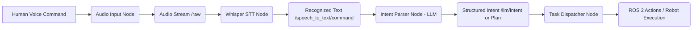

# 4.2 Voice-to-Action Pipeline (Whisper + ROS 2)

The Voice-to-Action Pipeline forms the critical front-end of our cognitive robot, translating the rich, nuanced input of human speech into structured, actionable commands that the robot can process. This module's ultimate objective is to establish a seamless, robust, and intuitive communication channel, enabling human users to command their robots using natural language, entirely bypassing traditional graphical user interfaces (GUIs) or complex programming environments. The vision is to enable a robot to respond as naturally to a spoken command as a human assistant would.

This pipeline is characterized by a series of interconnected ROS 2 nodes, each specializing in a distinct aspect of speech processing and intent extraction, designed for modularity, scalability, and fault tolerance inherent in the ROS 2 framework.

## Pipeline Breakdown: Architectural Overview

The Voice-to-Action pipeline consists of four primary, logically distinct stages, orchestrated as a chain of ROS 2 nodes:



### 1. Audio Input Node: The Robot's Digital Ear

This initial component is the robot's "ear," responsible for capturing the raw acoustic data of human speech from its environment.

*   **Functionality**:
    *   **Hardware Abstraction**: It interfaces directly with either a **real-time microphone** for physical robot deployments or a **simulated microphone** within high-fidelity simulation environments like NVIDIA Isaac Sim. This abstraction ensures consistency in the audio stream regardless of the deployment context, a crucial aspect for "sim-to-real" transfer.
    *   **Sampling and Buffering**: Continuously samples audio at a predefined rate (e.g., 16 kHz) and bit depth (e.g., 16-bit PCM), buffering it into manageable chunks. This is vital for real-time processing and reducing latency.
    *   **Pre-processing (Optional but Recommended)**: May perform basic audio pre-processing such as noise reduction, amplification, or voice activity detection (VAD) to improve the quality of the signal fed to the Speech-to-Text (STT) engine.
*   **ROS 2 Implementation Details**:
    *   **Node Name**: `audio_input_node`
    *   **Published Topic**: `/audio_input/raw` (or similar)
    *   **Message Type**: `std_msgs/msg/UInt8MultiArray` for raw byte data, or a custom message type like `vla_msgs/msg/AudioChunk` that might include metadata like sample rate, encoding, and chunk duration.
*   **Code Sketch (Conceptual `audio_input_node.py`):**
    ```python
    import rclpy
    from rclpy.node import Node
    from std_msgs.msg import UInt8MultiArray # Using a standard message for raw bytes
    import numpy as np
    # import sounddevice as sd # For real microphone interaction (requires installation)
    import time

    class AudioInputNode(Node):
        def __init__(self):
            super().__init__('audio_input_node')
            self.publisher_ = self.create_publisher(UInt8MultiArray, 'audio_input/raw', 10)
            self.timer = self.create_timer(0.1, self.publish_audio_chunk) # Publish every 100ms
            self.get_logger().info('Audio Input Node Initialized: Publishing to /audio_input/raw')
            self.sample_rate = 16000 # Hz
            self.chunk_size = 1600 # 100ms chunk for 16kHz
            # Placeholder for real audio stream
            # self.audio_stream = sd.InputStream(samplerate=self.sample_rate, channels=1, callback=self._audio_callback)
            # self.audio_stream.start()

        # def _audio_callback(self, indata, frames, time, status):
        #     if status:
        #         self.get_logger().error(f"Audio callback error: {status}")
        #     self.publish_audio_chunk(indata.flatten().tobytes()) # Process real data

        def publish_audio_chunk(self):
            # Simulate capturing audio data for demonstration purposes
            # In a real scenario, this would read from a microphone via an audio library (e.g., PyAudio, Sounddevice)
            simulated_audio_data = np.random.randint(0, 255, size=self.chunk_size, dtype=np.uint8) 
            
            msg = UInt8MultiArray()
            msg.data = list(simulated_audio_data)
            self.publisher_.publish(msg)
            # self.get_logger().debug(f'Published audio chunk of size {len(msg.data)}')

    def main(args=None):
        rclpy.init(args=args)
        node = AudioInputNode()
        try:
            rclpy.spin(node)
        except KeyboardInterrupt:
            pass
        finally:
            node.destroy_node()
            rclpy.shutdown()

    if __name__ == '__main__':
        main()
    ```

### 2. Whisper Speech-to-Text Node: The Linguistic Processor

This node serves as the "linguistic processor," converting the transient audio signals into persistent, intelligible textual commands.

*   **Technology**: Leverages **OpenAI's Whisper model**. Whisper is highly acclaimed for its robustness against background noise, diverse language support, and impressive accuracy, making it an ideal candidate for real-world robotic applications. It can be run locally (on GPU-accelerated hardware like NVIDIA Jetson or workstation RTX cards) for low-latency, privacy-preserving operations or via a cloud API for simplified deployment.
*   **Functionality**:
    *   **Audio Buffering**: Subscribes to the raw audio stream (`/audio_input/raw`) and continuously buffers incoming audio chunks.
    *   **Speech Detection**: Intelligent algorithms (or Whisper's internal VAD) detect the start and end of spoken utterances, preventing the model from processing silence or non-speech sounds unnecessarily.
    *   **Transcription**: Feeds segmented audio utterances into the Whisper model for automatic speech recognition.
    *   **Noise Robustness**: Whisper's architecture is inherently designed to perform well even in challenging, noisy environments, which is critical for robots operating outside controlled laboratory settings.
*   **ROS 2 Implementation Details**:
    *   **Node Name**: `whisper_stt_node`
    *   **Subscribed Topic**: `/audio_input/raw`
    *   **Published Topic**: `/speech_to_text/command`
    *   **Message Type**: `std_msgs/msg/String`
*   **Code Sketch (Conceptual `whisper_stt_node.py`):**
    ```python
    import rclpy
    from rclpy.node import Node
    from std_msgs.msg import UInt8MultiArray # Input audio bytes
    from std_msgs.msg import String          # Output text
    # import whisper # Assuming the OpenAI Whisper library is installed and configured
    import numpy as np
    # import io # For handling audio data in memory

    class WhisperSTTNode(Node):
        def __init__(self):
            super().__init__('whisper_stt_node')
            self.subscription = self.create_subscription(
                UInt8MultiArray,
                'audio_input/raw',
                self.audio_callback,
                10)
            self.publisher_ = self.create_publisher(String, 'speech_to_text/command', 10)
            self.audio_buffer = [] # Accumulate audio data
            self.last_speech_time = time.time()
            self.speech_timeout = 1.0 # Seconds of silence to consider utterance complete
            self.get_logger().info('Whisper STT Node Initialized: Subscribing to /audio_input/raw, Publishing to /speech_to_text/command')

            # self.whisper_model = whisper.load_model("base") # Load the Whisper model (e.g., 'base', 'small', 'medium')
            # Consider asynchronous loading or running in a separate thread if model is large

        def audio_callback(self, msg):
            self.audio_buffer.extend(msg.data)
            self.last_speech_time = time.time() # Reset timeout on new audio

            # A more sophisticated approach would use Voice Activity Detection (VAD)
            # For simplicity, we'll process after a short silence or fixed duration
            if (time.time() - self.last_speech_time > self.speech_timeout) and len(self.audio_buffer) > 0:
                self.process_audio_buffer()
                self.audio_buffer = [] # Clear buffer after processing

        def process_audio_buffer(self):
            if not self.audio_buffer:
                return

            # Convert buffer to a format Whisper expects (e.g., NumPy array of float32)
            # Assuming 16kHz 16-bit mono PCM, adapt as per your audio_input_node
            # audio_np = np.frombuffer(bytes(self.audio_buffer), dtype=np.int16).astype(np.float32) / 32768.0
            
            # Call Whisper model to transcribe
            # try:
            #     result = self.whisper_model.transcribe(audio_np, language="en") # Specify language for better performance
            #     recognized_text = result["text"].strip()
            # except Exception as e:
            #     self.get_logger().error(f"Whisper transcription failed: {e}")
            #     recognized_text = ""

            # Simulated result for demonstration
            recognized_text = "Simulated: pick up the red box" # Replace with actual Whisper output
            if self.audio_buffer[0] % 2 == 0: # Simple simulation of different commands
                recognized_text = "Simulated: navigate to the kitchen"
            
            if recognized_text:
                self.get_logger().info(f'Transcribed: "{recognized_text}"')
                text_msg = String()
                text_msg.data = recognized_text
                self.publisher_.publish(text_msg)
                self.get_logger().info(f'Published recognized text: "{recognized_text}" to /speech_to_text/command')

    def main(args=None):
        rclpy.init(args=args)
        node = WhisperSTTNode()
        try:
            rclpy.spin(node)
        except KeyboardInterrupt:
            pass
        finally:
            node.destroy_node()
            rclpy.shutdown()

    if __name__ == '__main__':
        main()
    ```
    **Note on Whisper Integration**:
    *   Loading the Whisper model can be computationally intensive. It's often done once during node initialization.
    *   Audio format (sample rate, bit depth, channels) must be consistent between the `Audio Input Node` and the `Whisper Node`.
    *   Consider using smaller Whisper models (`base`, `small`) for edge devices (e.g., Jetson) for faster inference, or larger models (`medium`, `large`) for higher accuracy on more powerful hardware.

### 3. Intent Parser Node: Decoding Human Intent

This is the cognitive gateway, where raw text transforms into structured, machine-interpretable intent. This step is crucial for bridging the gap between ambiguous human language and precise robotic commands.

*   **Technology**: An **LLM-based approach** is paramount for sophisticated natural language understanding. This LLM (e.g., OpenAI's GPT-4o, or a fine-tuned open-source model like Llama 3) is given a specific role and context to extract key semantic elements from the recognized text. The choice of LLM depends on computational resources, accuracy requirements, and privacy considerations (local vs. cloud API).
*   **Functionality**:
    *   **Textual Input**: Subscribes to the textual command stream from the Whisper node (`/speech_to_text/command`).
    *   **Semantic Parsing**: Leverages the LLM to perform advanced natural language processing tasks:
        *   **Action Verb Identification**: Distinguishes the core action (e.g., "pick", "scan", "navigate", "clean").
        *   **Named Entity Recognition (NER)**: Identifies specific objects (e.g., "red box", "cup"), locations (e.g., "kitchen", "table"), and other relevant entities mentioned in the command.
        *   **Contextual Understanding**: Interprets the relationships between these entities and the action within the broader context of robotic capabilities.
    *   **Ambiguity Resolution**: If the command is ambiguous (e.g., "pick up the thing"), the LLM can be prompted to generate a clarifying question that the robot can speak back to the user.
*   **Structured Output**: The LLM's raw text response is parsed into a structured data format, most effectively JSON, representing the extracted intent. This structured intent is then converted into a `vla_msgs/srv/GetPlan` request or directly into a `vla_msgs/msg/Plan` message.
*   **Conceptual LLM Prompt Structure**:
    ```
    "You are a highly capable robot assistant. The user has given a voice command: '{user_command}'. Your task is to extract the primary action, the target object/location, and any secondary locations/modifiers. If the command is unclear or ambiguous, identify the ambiguity and suggest a clarifying question. Output your analysis as a JSON object with keys: 'action', 'target', 'secondary_location' (optional), 'ambiguity' (optional), 'clarification_question' (optional). Examples:
    - Input: 'Pick up the red box from the table.' Output: {'action': 'pick_up', 'target': 'red box', 'secondary_location': 'table'}
    - Input: 'Go to the kitchen.' Output: {'action': 'navigate', 'target': 'kitchen'}
    - Input: 'Pick up the thing.' Output: {'action': 'clarify', 'ambiguity': 'unspecified object', 'clarification_question': 'Which object would you like me to pick up?'}
    - Input: 'Clean the room.' Output: {'action': 'clean_room', 'target': 'room'}
    Output only the JSON."
    ```
*   **ROS 2 Implementation Details**:
    *   **Node Name**: `llm_node` (as per `tasks.md`)
    *   **Subscribed Topic**: `/speech_to_text/command`
    *   **Service Server**: `get_plan` (of type `vla_msgs/srv/GetPlan`) to receive commands and return a `Plan` message.
*   **Code Sketch (Conceptual `llm_node.py` - simplified from earlier, focusing on LLM interaction):**
    ```python
    import rclpy
    from rclpy.node import Node
    from std_msgs.msg import String as Text
    from vla_msgs.srv import GetPlan
    import json
    # import openai # For actual GPT-4o API calls

    class LLMNode(Node):
        def __init__(self):
            super().__init__('llm_node')
            self.subscription = self.create_subscription(
                Text,
                'speech_to_text/command',
                self.text_command_callback,
                10)
            self.srv = self.create_service(GetPlan, 'get_plan', self.get_plan_callback)
            self.get_logger().info('LLM Node Initialized: Subscribing to /speech_to_text/command, Serving get_plan')

            # self.openai_client = openai.OpenAI(api_key="YOUR_OPENAI_API_KEY") # Initialize OpenAI client

        def text_command_callback(self, msg):
            self.get_logger().info(f'Received raw text command: "{msg.data}"')
            # This callback could also directly call the LLM and publish a plan if no service client is used

        def call_llm_for_plan(self, user_command):
            # In a real scenario, this would call the OpenAI API or a local LLM
            # For demonstration, we simulate different LLM responses
            prompt_template = """You are a robotic task planner. Break down user commands into atomic, sequential robot actions.
            User command: '{user_command}'.
            Provide the plan in JSON format with 'goal' and 'steps'. If the command is 'clean the room', return a cleaning plan.
            If 'pick up the red box', return steps for picking. If 'navigate to the kitchen', return navigation steps.
            If unclear, return a plan with a 'clarify' goal. Output only the JSON."""
            
            # Example simulated LLM responses
            command_lower = user_command.lower()
            if "clean the room" in command_lower:
                return json.dumps({"goal": "clean_room", "steps": ["scan_room", "identify_dirty_objects", "navigate_to_object", "pick_object", "place_in_bin"]})
            elif "pick up the red box" in command_lower:
                return json.dumps({"goal": "pick_up_red_box", "steps": ["locate_red_box", "navigate_to_red_box", "grasp_red_box", "lift_red_box"]})
            elif "navigate to the kitchen" in command_lower:
                return json.dumps({"goal": "navigate_to_kitchen", "steps": ["plan_path_to_kitchen", "execute_navigation_to_kitchen", "confirm_arrival_in_kitchen"]})
            else:
                return json.dumps({"goal": "clarify_command", "steps": ["ask_user_for_clarification"]})

            # Real API call (conceptual):
            # response = self.openai_client.chat.completions.create(
            #     model="gpt-4o",
            #     messages=[
            #         {"role": "system", "content": prompt_template},
            #         {"role": "user", "content": user_command}
            #     ]
            # )
            # return response.choices[0].message.content

        def get_plan_callback(self, request, response):
            self.get_logger().info(f'Received GetPlan service request for command: "{request.command}"')
            llm_raw_response = self.call_llm_for_plan(request.command)
            
            try:
                plan_data = json.loads(llm_raw_response)
                response.plan.goal = plan_data.get("goal", "unknown")
                response.plan.steps = plan_data.get("steps", [])
                self.get_logger().info(f'LLM generated plan: Goal="{response.plan.goal}", Steps={response.plan.steps}')
            except json.JSONDecodeError as e:
                self.get_logger().error(f"Failed to parse LLM response JSON: {e}. Raw response: {llm_raw_response}")
                response.plan.goal = "error_parsing_llm_response"
                response.plan.steps = []
            
            return response

    def main(args=None):
        rclpy.init(args=args)
        llm_node = LLMNode()
        try:
            rclpy.spin(llm_node)
        except KeyboardInterrupt:
            pass
        finally:
            llm_node.destroy_node()
            rclpy.shutdown()

    if __name__ == '__main__':
        main()
    ```
    **Key Considerations for LLM Integration**:
    *   **Prompt Engineering**: The quality of the LLM's output is highly dependent on the prompt. Prompts must be carefully designed to define the LLM's role, desired output format (e.g., JSON schema), and provide clear examples.
    *   **Context Management**: For complex, multi-turn interactions, the LLM might need to maintain conversational context.
    *   **Safety and Guardrails**: Implement mechanisms to ensure the LLM generates safe and appropriate robot actions.
    *   **Latency**: Cloud LLMs introduce network latency. For real-time applications, consider local, smaller models or optimizing API calls.

### 4. Task Dispatcher: The Robotic Conductor

The final arbiter in the pipeline, the Task Dispatcher, takes the structured intent and orchestrates the invocation of appropriate robotic subsystems. It is the central control unit that translates logical plan steps into physical robot execution commands.

*   **Functionality**:
    *   **Plan Reception**: Serves as an Action Server (e.g., for `vla_msgs/action/ExecutePlan`) that receives a `vla_msgs/msg/Plan` containing the sequence of steps to execute.
    *   **Step-by-Step Execution**: Iterates through each step in the received plan.
    *   **Capability Mapping**: Maintains a comprehensive mapping between high-level logical plan steps (e.g., "navigate_to_object", "pick_object", "scan_room") and specific ROS 2 actions, services, or topics provided by various robot capabilities (e.g., Nav2, Manipulation Action Servers, Perception Query Services).
    *   **Execution Monitoring**: Monitors the execution of each sub-task, handling success, failure, and providing feedback.
    *   **Feedback Mechanism**: Publishes real-time feedback during plan execution (e.g., "Executing step: navigate_to_red_box") and reports overall plan completion or failure.
*   **ROS 2 Implementation Details**:
    *   **Node Name**: `task_dispatcher_node`
    *   **Action Server**: `execute_plan` (of type `vla_msgs/action/ExecutePlan`)
    *   **Action Clients**: Acts as clients to external ROS 2 action servers for navigation (`nav2_msgs/action/NavigateToPose`), manipulation (custom `vla_msgs/action/PickAndPlace`), and potentially perception query services.
*   **Code Sketch (Conceptual `task_dispatcher_node.py` - simplified from earlier, focusing on dispatching):**
    ```python
    import rclpy
    from rclpy.node import Node
    from rclpy.action import ActionServer, ActionClient
    from rclpy.action.server import ServerGoalHandle
    from vla_msgs.action import ExecutePlan # Custom action type
    from vla_msgs.srv import GetPlan       # Service client to LLMNode
    from std_msgs.msg import String        # For voice feedback
    # from nav2_msgs.action import NavigateToPose # Example external action
    # from vla_msgs.action import PickAndPlace   # Example custom manipulation action

    class TaskDispatcherNode(Node):
        def __init__(self):
            super().__init__('task_dispatcher_node')
            self.get_logger().info('Task Dispatcher Node Initialized')

            # ROS 2 Action Server for executing plans
            self._execute_plan_action_server = ActionServer(
                self,
                ExecutePlan,
                'execute_plan',
                self.execute_plan_callback
            )
            # ROS 2 Service Client for getting plans from LLMNode
            self.llm_service_client = self.create_client(GetPlan, 'get_plan')
            while not self.llm_service_client.wait_for_service(timeout_sec=1.0):
                self.get_logger().info('LLM service not available, waiting...')

            self.voice_feedback_publisher = self.create_publisher(String, 'voice_feedback', 10)

            # Example Action Clients for external capabilities (conceptual)
            # self._nav_client = ActionClient(self, NavigateToPose, 'navigate_to_pose')
            # self._manip_client = ActionClient(self, PickAndPlace, 'pick_and_place')

            # For demonstration, a timer to simulate receiving a command
            self.timer = self.create_timer(10.0, self.simulate_command_reception)


        def simulate_command_reception(self):
            # This timer simulates an external trigger (e.g., user speech)
            # In a real system, the llm_node might directly publish a plan,
            # or a separate node would serve as the bridge.
            self.get_logger().info("Simulating new command: 'clean the room'")
            request = GetPlan.Request()
            request.command = "clean the room"
            self.llm_service_client.call_async(request).add_done_callback(self.plan_response_callback)


        def plan_response_callback(self, future):
            try:
                response = future.result()
                if response.plan.goal == "clarify_command":
                    self.publish_voice_feedback("I did not understand. Could you please rephrase?")
                    self.get_logger().warn("LLM requested clarification.")
                    return
                self.get_logger().info(f"Received plan from LLM: Goal='{response.plan.goal}', Steps={response.plan.steps}")
                
                # Immediately send this plan to its own action server for execution
                goal_msg = ExecutePlan.Goal()
                goal_msg.plan = response.plan
                
                # In a real system, another node might be the action client, or this node
                # would call its own action server's callback directly.
                self.get_logger().info(f"Dispatching plan '{response.plan.goal}' for execution.")
                # This part would involve an ActionClient to its own action server if it's truly separated
                # For direct execution, call the callback:
                # self.execute_plan_callback_direct(goal_msg) # Direct call for simplicity in simulation
                # For a proper action client-server loop in the same node:
                selfaction_client = ActionClient(self, ExecutePlan, 'execute_plan')
                while not selfaction_client.wait_for_server(timeout_sec=1.0):
                    self.get_logger().info('ExecutePlan action server not available, waiting...')
                selfaction_client.send_goal_async(goal_msg).add_done_callback(
                    lambda future: self.get_logger().info(f"Plan execution initiated. Goal accepted: {future.result().accepted}")
                )

            except Exception as e:
                self.get_logger().error(f"Error getting plan from LLM: {e}")
                self.publish_voice_feedback("Error processing command.")


        def execute_plan_callback(self, goal_handle: ServerGoalHandle):
            self.get_logger().info(f'Executing Plan: {goal_handle.request.plan.goal}')
            feedback_msg = ExecutePlan.Feedback()
            
            plan = goal_handle.request.plan
            self.publish_voice_feedback(f"Starting plan: {plan.goal}")

            success = True
            for i, step in enumerate(plan.steps):
                if not rclpy.ok(): # Check if node is still active
                    goal_handle.canceled()
                    self.get_logger().info('Plan execution cancelled.')
                    return

                self.get_logger().info(f'Executing step {i+1}/{len(plan.steps)}: {step}')
                feedback_msg.feedback = f"Executing step {i+1}: {step}"
                goal_handle.publish_feedback(feedback_msg)

                # --- Here is where actual calls to other ROS 2 capabilities would happen ---
                try:
                    if "navigate" in step:
                        self.get_logger().info(f"Calling Nav2 for: {step}")
                        # Example: send_nav_goal(step_target)
                        # rclpy.spin_until_future_complete(self, self._nav_client.send_goal_async(NavigateToPose.Goal(...)))
                        rclpy.spin_until_future_complete(self, rclpy.create_timer(2.0, lambda: None).timer_future) # Simulate
                    elif "locate" in step or "identify" in step or "scan" in step:
                        self.get_logger().info(f"Calling Perception for: {step}")
                        # Example: call_perception_service(step_target)
                        rclpy.spin_until_future_complete(self, rclpy.create_timer(1.0, lambda: None).timer_future) # Simulate
                    elif "pick" in step or "grasp" in step or "place" in step or "lift" in step:
                        self.get_logger().info(f"Calling Manipulation for: {step}")
                        # Example: send_manipulation_goal(step_target)
                        rclpy.spin_until_future_complete(self, rclpy.create_timer(3.0, lambda: None).timer_future) # Simulate
                    elif "ask_user" in step: # For clarification from LLM
                        self.publish_voice_feedback("I need more information to proceed. Could you please clarify?")
                        rclpy.spin_until_future_complete(self, rclpy.create_timer(5.0, lambda: None).timer_future) # Wait for user input
                    else:
                        self.get_logger().info(f"Unknown step type: {step}. Simulating generic work.")
                        rclpy.spin_until_future_complete(self, rclpy.create_timer(1.0, lambda: None).timer_future) # Simulate
                except Exception as e:
                    self.get_logger().error(f"Error during step '{step}': {e}")
                    self.publish_voice_feedback(f"Failed to execute step: {step}. {str(e)}")
                    success = False
                    break # Stop execution on first failure

            result = ExecutePlan.Result()
            result.success = success
            if success:
                goal_handle.succeed()
                self.publish_voice_feedback(f"Plan '{plan.goal}' completed successfully!")
                self.get_logger().info(f"Plan '{plan.goal}' executed successfully!")
            else:
                goal_handle.abort()
                self.publish_voice_feedback(f"Plan '{plan.goal}' failed during execution.")
                self.get_logger().warn(f"Plan '{plan.goal}' execution aborted.")
            return result

        def publish_voice_feedback(self, feedback_text):
            msg = String()
            msg.data = feedback_text
            self.voice_feedback_publisher.publish(msg)
            self.get_logger().info(f"Voice Feedback: {feedback_text}")

    def main(args=None):
        rclpy.init(args=args)
        node = TaskDispatcherNode()
        executor = rclpy.executors.MultiThreadedExecutor()
        executor.add_node(node)
        try:
            executor.spin()
        except KeyboardInterrupt:
            pass
        finally:
            node.destroy_node()
            rclpy.shutdown()

    if __name__ == '__main__':
        main()
    ```
    **Key Design Principles for Task Dispatcher**:
    *   **Modular Invocation**: Each logical step in the plan is mapped to a specific ROS 2 capability (Action Server, Service, or Topic). This promotes modularity and allows for easy swapping or upgrading of underlying capabilities (e.g., replacing one navigation stack with another).
    *   **State Management**: The dispatcher maintains the state of the overall plan. If a sub-task fails, it decides whether to attempt recovery, report failure, or trigger a re-planning phase.
    *   **Concurrency**: Using `MultiThreadedExecutor` (as shown in the `main` function) is essential when a node acts as both a service client/server and an action client/server to handle callbacks concurrently.
    *   **Feedback and Error Reporting**: Continuous feedback (`ExecutePlan.Feedback`) keeps the user informed of progress, and clear error messages facilitate debugging and user intervention.

This robust Voice-to-Action Pipeline is the foundation upon which the cognitive abilities of our humanoid robot are built, allowing for intuitive and powerful human-robot collaboration, transcending mere remote control to true intelligent partnership.