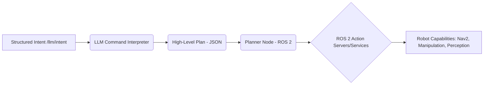

# 4.3 Cognitive Planning (LLM → High-Level Plan → ROS2 Actions)

The Cognitive Planning module is the central nervous system of our Vision-Language-Action (VLA) robot, transforming abstract human intentions into a structured, executable sequence of robotic maneuvers. Unlike purely reactive systems, this module endows the robot with the capacity for proactive, multi-step problem-solving. It's where the robot "thinks" about how to achieve a given goal, breaking down complex tasks into manageable sub-goals and orchestrating their execution. This is the very core of VLA, enabling truly intelligent and autonomous behavior.

### The Need for Cognitive Planning

Traditional robotics often relies on hard-coded state machines or behavior trees designed for specific scenarios. While effective for repetitive, predictable tasks, this approach struggles with:
*   **Novelty**: Adapting to unforeseen circumstances or unscripted commands.
*   **Ambiguity**: Interpreting high-level human language which is often imprecise.
*   **Complexity**: Decomposing multi-faceted goals into atomic, executable steps.
*   **Robustness**: Recovering from failures or adapting to dynamic environments.

Cognitive planning, powered by Large Language Models (LLMs), offers a solution by enabling the robot to generate plans dynamically, reason about its environment, and adapt its behavior in real-time.

## Process Breakdown: Architectural Stages

The cognitive planning process involves two primary, logically distinct stages, working in tandem to bridge the semantic gap between human intention and robotic execution:



### 1. LLM Command Interpreter: The Robot's Strategic Brain

This component functions as the robot's strategic decision-maker, taking the high-level, natural-language command (as processed and structured by the Intent Parser in the Voice-to-Action Pipeline, typically received via a ROS 2 service call) and conceptualizing a strategic approach to fulfill it.

*   **Input**: A concise natural-language command or structured intent (e.g., a string from a `vla_msgs/srv/GetPlan` request) such as: "Clean the room."
*   **Technology**: Utilizes a powerful Large Language Model (LLM), like OpenAI's GPT-4o. The key to successful integration lies in **prompt engineering**. The LLM is given a specific role (e.g., "You are a robotic task planner. Break down user commands into atomic, sequential robot actions.") and provided with crucial context about the robot's capabilities, current state, and environmental knowledge. This context can include available tools (ROS 2 actions), known object types, or environmental maps.
*   **Functionality**:
    *   **Goal Decomposition**: The LLM analyzes the command, retrieves relevant knowledge (e.g., typical steps for "cleaning a room," which might involve identifying objects, navigating, grasping, and placing), and synthesizes a high-level plan.
    *   **Constraint Satisfaction**: It implicitly (or explicitly, if prompted) considers constraints such as robot kinematics, safety protocols, and task dependencies.
    *   **Structured Output Generation**: The LLM is instructed to output the plan in a machine-readable, unambiguous structured data format, most effectively JSON. This format allows subsequent robotic processes to easily parse and act upon the plan.
*   **Output**: A detailed, structured plan, typically in JSON format, outlining the logical steps required to achieve the goal. This plan focuses on high-level logical steps, not yet on the exact robotic movements or low-level ROS 2 calls.

    **Example Output (structured JSON plan for "Clean the room"):**
    ```json
    {
      "goal": "clean_room",
      "steps": [
        "scan_room",                // Utilize perception to identify items
        "identify_dirty_objects",   // Filter for relevant items (e.g., trash, misplaced objects)
        "navigate_to_object",       // Approach each identified object one by one
        "pick_object",              // Grasp the object using manipulator
        "place_in_bin"              // Deposit in a designated receptacle (e.g., trash can, storage bin)
      ],
      "estimated_time_minutes": 15,
      "priority": "normal"
    }
    ```
    **Conceptual LLM Prompt (example for a "clean the room" command):**
    ```text
    "You are a robotic task planner for a humanoid robot. The robot can navigate, perceive objects, pick them up, and place them. It operates in a typical home environment. The user's command is: 'Clean the room'.
    Please generate a detailed, sequential plan in JSON format. Each step should be a clear, high-level action that the robot can perform. Ensure the plan addresses identifying items, moving to them, interacting, and disposing/organizing. Include 'goal' and a list of 'steps'. You can also add 'estimated_time_minutes' and 'priority'. Output only the JSON object."
    ```
*   **ROS 2 Interface**: The `llm_node` (as implemented in Section 4.2) acts as a ROS 2 service server for `vla_msgs/srv/GetPlan`. It receives the command string and returns the `vla_msgs/msg/Plan` message populated from the parsed LLM JSON output.

### 2. Planner Node (Bridging LLM → ROS 2): The Operational Orchestrator

This crucial node acts as the operational orchestrator, bridging the abstract, LLM-generated plan with the concrete, executable ROS 2 actions. It interprets each logical step and translates it into a series of commands for various robot subsystems. This node is essentially a state machine that progresses through the plan, dynamically calling ROS 2 services and actions.

*   **Functionality**:
    *   **Plan Ingestion**: Subscribes to the LLM's structured plan output (or receives it via an action goal from the Task Dispatcher).
    *   **Step-wise Translation**: For each logical step in the plan (e.g., `scan_room`, `navigate_to_object`, `pick_object`), the Planner Node identifies and invokes the necessary ROS 2 actions or services. This involves a lookup table or a more advanced mapping logic that links semantic actions to ROS 2 interfaces.
    *   **State Management**: Manages the overall plan execution state. It tracks which step is currently active, handles transitions to the next step upon successful completion, and implements logic for failure handling and recovery.
*   **Interactions with ROS 2 Subsystems**: The Planner Node acts as a client to various ROS 2 servers, communicating with different robotic capabilities. This modular approach allows for easy swapping or upgrading of underlying capabilities.
    *   **Nav2 (Navigation Stack)**: Invoked for `navigate_to_object`, `navigate_to_location`, `scan_room` (which may involve specific navigation patterns). The Planner Node sends `nav2_msgs/action/NavigateToPose` goals to Nav2's action server.
    *   **Perception Stack**: Queried for `identify_dirty_objects`, `locate_object`. This might involve calling ROS 2 services provided by perception nodes (e.g., `vla_msgs/srv/GetObjectPose`) or subscribing to filtered object detection topics (e.g., `/perception/object_detections`).
    *   **Manipulation Stack**: Utilized for `pick_object`, `place_in_bin`. This typically involves sending goals to custom manipulation action servers (e.g., `vla_msgs/action/PickAndPlace`).
    *   **Arm Controllers**: Lower-level control for specific joint movements during manipulation. These might be directly controlled or abstracted via a higher-level manipulation action.
    *   **Object ID Modules**: Provides specific information about identified objects for targeted interaction, often through ROS 2 topics or services that expose detected object attributes and poses.

### 3. Action Execution and Dynamic Adaptation

The execution of the plan is not a rigid, pre-scripted sequence. It's a dynamic process managed by a robust state machine that allows for real-time adaptation and resilience in the face of environmental uncertainties.

*   **State-machine Based Execution**: The Planner Node orchestrates the plan as a sequence of states, where each state corresponds to a logical step. Transitions between states depend on the success or failure of the invoked ROS 2 actions. This allows for complex sequences and branching logic.
*   **Dynamic Environmental Monitoring**: During execution, the robot continuously monitors its environment using its sensors. For instance, before picking an object, it might re-verify its pose and the object's exact location using perception queries. This ensures actions are based on the most current environmental state.
*   **Handling Unexpected Obstacles and Deviations**:
    *   If Nav2 encounters an unexpected obstacle during navigation, it will first attempt to re-plan its path locally.
    *   If local re-planning fails or is insufficient, the Planner Node receives a failure signal from Nav2.
    *   The Planner Node can then implement pre-defined **recovery behaviors** (e.g., move backward, rotate, try an alternative route).
    *   **Re-planning When Necessary**: In cases of significant deviation or unresolvable failures (e.g., `object_not_found_after_navigation`, `path_blocked_indefinitely`, `failed_to_grasp_object`), the Planner Node can trigger a more extensive re-planning phase. This might involve:
        *   **Querying the LLM again**: Sending the current state and observed failure back to the LLM with an updated prompt (e.g., "Attempted to pick red box at X,Y,Z but it is no longer there. What should I do?").
        *   **Dynamic Plan Modification**: Adjusting the remaining steps of the current plan based on new sensory information or LLM guidance.
        *   **User Intervention**: If autonomy fails, the robot reports the issue to the user and asks for new instructions, leveraging the Voice-to-Action pipeline.

This dynamic, adaptive execution demonstrates true robotic autonomy, moving far beyond mere pre-programmed routines to interact intelligently and effectively with an unpredictable physical world. It is the definitive step towards robots that can not only understand what you want but figure out how to achieve it, even when conditions are not ideal. The ability to sense, plan, act, and crucially, *re-plan*, is what defines a cognitive robot.